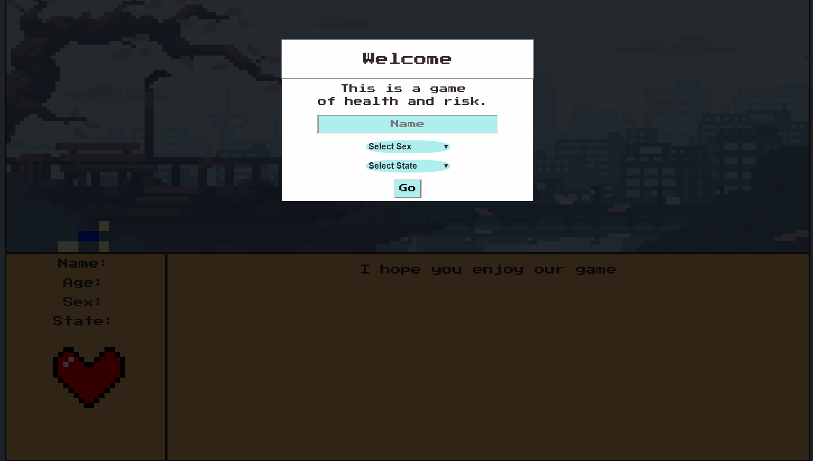
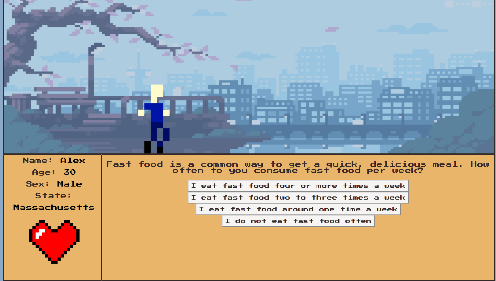
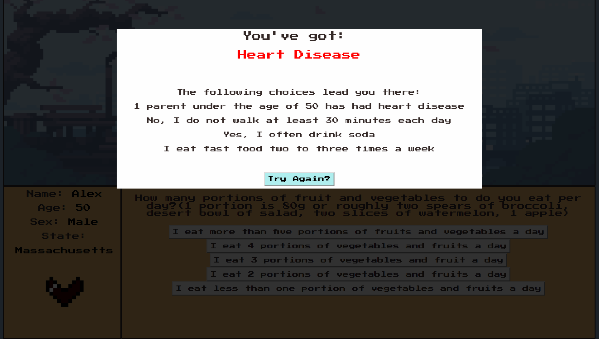
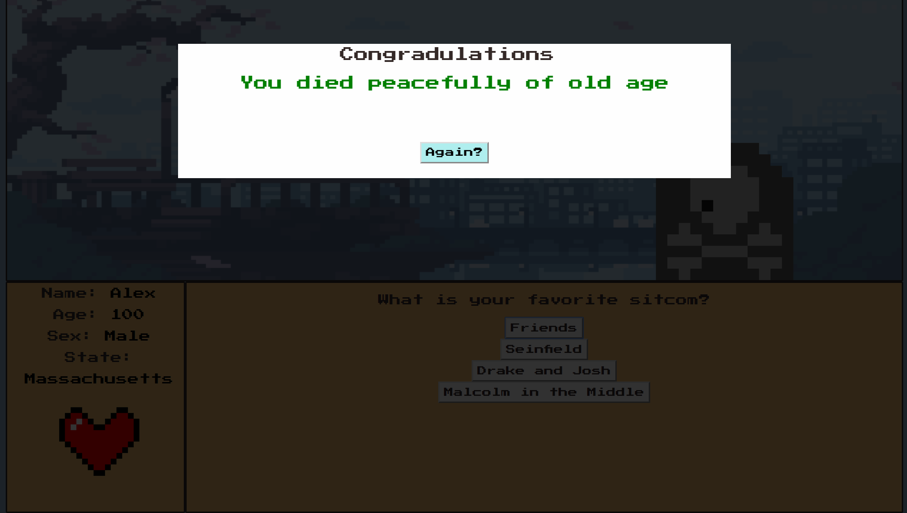

# Bad4You
# Team: Big Ballers
# Members:
  Jordan Chen - <a href="http://www.github.com/curious-jor">curious-jor</a>(Frontend-Developer)
  
  Niel Carlson - <a href="http://www.github.com/necarlson97">necarlson97</a>(Backend Developer)
  
  Alex Yuan - <a href="http://www.github.com/alexyuan2424">alexyuan24</a>(Data Analyst)
  
  Liam Corbett - <a href="http://www.github.com/liamcorbett">liamcorbett</a>(Database Designer)
  
  
# Todo
- [X] Compile Relative Risk Data
- [X] Create page layout
- [X] Work on HTML buttons, forms
- [X] Design Data Schema
- [X] Create question/answer bank
- [X] Use modal submit to update user info
- [X] Hook up client script to google script
- [X] Player Icon and Heart
- [X] Death Sprite
- [X] Animate player icon and heart

# Description
Everyone knows candy is bad for you. But everyone also knows everything is bad for you. Cigarettes, alcohol, plastic, sitting, and even *running* are bad for you. So how do you enjoy your life knowing all of this?  
  
Bad4You is a browser-based life simulator. Give it your name, age, and the state you live in to get started. Then answer a series of questions about your lifestyle. Do you eat your vegetables? Do you drink soda? Do you smoke? Your answers to these questions will be compared to a collection of relative risk data. Bad4You then determines your risk of heart disease for every choice you make. See your decisions played out over the course of your life and get a sense of how those decisions affect your health.

# How to Play
Clone this repository and open index.html. Enter your name, sex, and the state you live in. Then start answering questions in the bottom right. Click "Play Again" if you get to the end, or die.
Bad4You/static/assets/StartupScreen.png

# Startup

# Gameplay

# Result:Death

# Result: Success!

